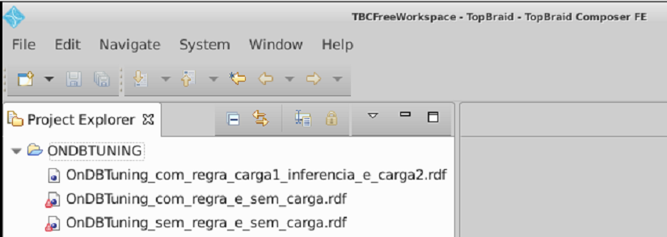

# OnDBTuning

O objetivo desse repositório é disponibilizar os scripts da ontologia OnDBTuning (https://www.ime.uerj.br/ondbtuning/) com as inclusões de novas propriedades, regras e cargas, oriundas da Dissertação de Mestrado (https://www.maxwell.vrac.puc-rio.br/58605/58605.PDF). 
Para acessar o vídeo de defesa da Dissertação [clique aqui](video/defesa.mp4)

Os scripts estão organizados da seguinte forma com a ontologia OnDBTuning:

- OnDBTuning_sem_regra_e_sem_carga.rdf => sem as regras criadas para índices, visões materializadas, decomposição SQL, cálculo de bônus e utilidade;

- OnDBTuning_com_regra_e_sem_carga.rdf => com as regras de decomposição SQL, cálculo de bônus e utilidade e com as seguintes regras para índices e visões materializadas:
    - tuning:RuleHypSimpleIndex, 
    - tuning:RuleHypCompositeIndex,
    - tuning:RuleSimplePartialIndex e 
    - tuning:RuleHypViewAdapted.

- OnDBTuning_com_regra_carga1_inferencia_e_carga2.rdf = > com as regras criadas (citadas no item anterior) e com algumas instâncias da carga do benchmarch TPC-H (www.tpc.org/tpch/). Sugestões de índice hipotéticos, índices parciais e visões materializadas, cálculo de utilidade e bônus, decomposição SQL foram inferidas com a carga de trabalho do TPC-H e persistidas nessa versão da OnDBTuning. E uma segunda carga de trabalho composta
pela consulta Q3 do TPC-H foi instanciada na OnDBTuning, conforme descrita no documento de dissertação no último parágrafo do item 4.4, porém precisa ser executada para visualizar a inferência desses resultados.

Para mapeamento de carga de dados RDF de entrada na OnDBTuning 

## Regras:

 - Para as regras de decomposição SQL 

 - Para as regras de sugestões de índices hipotéticos e parcial 

  - Para a regra de sugestão de visão materializada 

 - Para a regra de cálculo do Bônus 

 - Para a regra de cálculo da Utilidade 

## TopBraid:

Para as alterações da ontologia OnDBTuning utilizou-se a ferramenta TopBraid Composer Free Edition na versão 6.0.1 (https://archive.topquadrant.com/topbraid-composer-install/), que através de sua máquina de regras denominada TopSPIN possibilitou a inferência de novos indivíduos da ontologia. Essa ferramenta pode ser executada nos Sistemas Operacionais Linux e Windows.

Para visualização das instâncias, window "Instances":

Para execução das inferências na Ontologia na ferramenta TopBraid:

Para visualização das inferências, window "Inferences":

Para deletar as inferências na Ontologia executadas na ferramenta TopBraid::

**Observações:**

- Para dicas do Tutorial do TopBraid 

- Em consulta a página que possui dados sobre o TopBraid em 12/2022 (https://www.topquadrant.com/). Para acessar algumas referências utilizadas nesse trabalho de pesquisa, é necessário substituir "www" por "archive", pois eles fizeram uma nova página, porém arquivaram o conteúdo da antiga. Segue abaixo imagens com exemplo sobre:

## Detalhes sobre o TopBraid e código do OnDBTuning na VM065 da PUC-Rio:

Os scripts da OnDBTuning estão nesse caminho abaixo:

Tem uma versão do TopBraid nesse caminho, só clicar em "TopBraid Composer" para abrir a ferramenta:

Os scripts da OnDBTuning podem ser encontrados na pasta ONDBTUNING em Project Explorer, bastando clique duplo para abrir seu conteúdo na ferramenta:

Essas pastas destacadas em amarelos, foram testes que fiz no início:

**Observações:**

- Para dicas de acesso a VM graficamente .

- Caso tenham dificuldade de download do TopBraid, tem um executável para Linux no seguinte caminho na VM (/home/cloud-di/Downloads).

