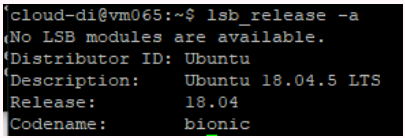
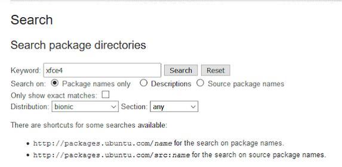
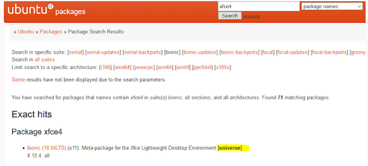
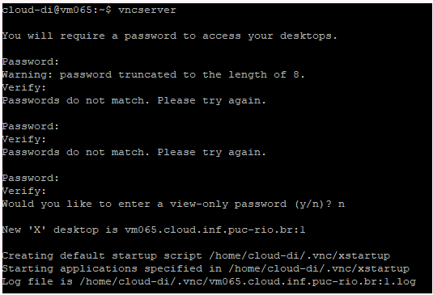
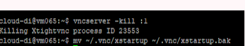
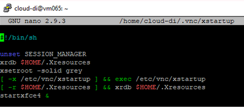
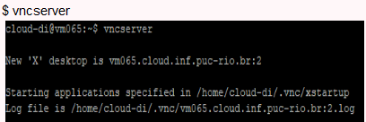
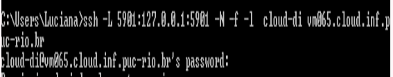
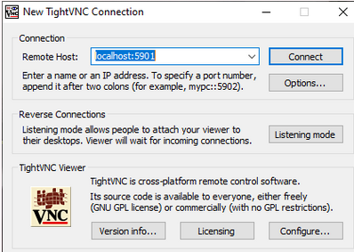
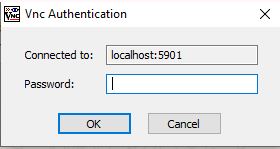

Segue abaixo algumas anotações que tenho de como realizei a configuração da VM, acesso ao VNC e no final algumas referências que me ajudaram no acesso gráfico a MV.

# 1 - Configurando a MV 

$ sudo apt update

$ sudo apt install xfce4 xfce4-goodies

//Não conseguiu localizar:

$ lsb_release -a   //consegui descobrir detalhes da distribuição que é bionic

https://packages.ubuntu.com/

$ sudo add-apt-repository universe

$ sudo apt update

$ sudo apt install tightvncserver

$ vncserver

//(tem que configurar uma senha que será utilizada depois no TightVNC Connection)

$ vncserver -kill :1

$ mv ~/.vnc/xstartup ~/.vnc/xstartup.bak

$ nano ~/.vnc/xstartup

// adicionar o conteúdo abaixo nesse arquivo

$ sudo chmod +x ~/.vnc/xstartup

#  2 - Executando o VNC

 A - Na linha de comando da conexão via ssh que fiz com o Putty, digitei:

B- Na linha de comando (cmd) da minha máquina digitei:

C:\Users\Luciana>ssh -L 5901:127.0.0.1:5901 -N -f -l  cloud-di vm065.cloud.inf.puc-rio.br  

A SENHA AQUI é a do cloud-di :

**TightVNC Connection***

SENHA CADASTRADA NA CONFIGURAÇÃO

#  Referências
<https://www.digitalocean.com/community/tutorials/how-to-install-and-configure-vnc-on-ubuntu-18-04-pt>

<https://www.youtube.com/watch?v=QTlU1EZQZg0>

<https://itsfoss.com/unable-to-locate-package-error-ubuntu/>

<https://packages.ubuntu.com/>

<https://packages.ubuntu.com/search?keywords=xfce4&searchon=names&suite=bionic&section=all>

<https://linuxize.com/post/how-to-install-and-configure-vnc-on-ubuntu-18-04/>