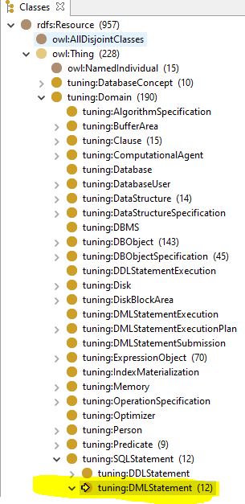

# Decomposição SQL

"As consultas da carga de trabalho instanciada na ontologia foram submetidas ao processo de decomposição (parsing), visto que as heurísticas de tuning
dependem da estrutura dessas consultas. Esse processo usado para dividir SQL
em nós indivisíveis foram compostos por 6 (seis) spin:rules. Foi utilizado o comando CONSTRUCT para inferir novas triplas, categorizadas por seus nós e
relacionamentos baseados nas classes e propriedades da OnDBTuning." (conforme item 3.2 da Dissertação de Mestrado)

As 6 (seis) *spin:rules*, podem ser encontradas no seguinte caminho na OnDBTuning, conforme destacado na figura abaixo em amarelo:

São elas:

**QueryStatment**

**SelectClause, ReferencedColumn, FromClause, ReferencedTable**

**WhereClause,ReferencedColumn, CompositeExpression, AtomicExpression, Literal**

**GroupBy**

**HavingClause**

**OrderByClause**

