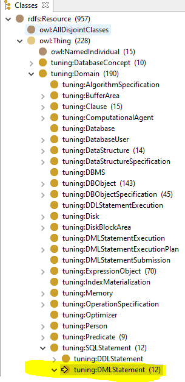
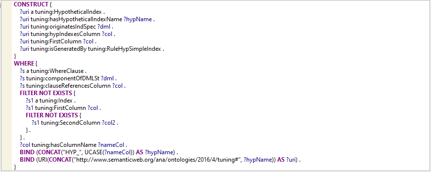
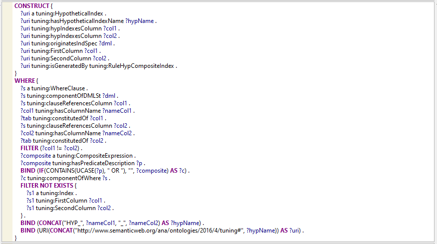
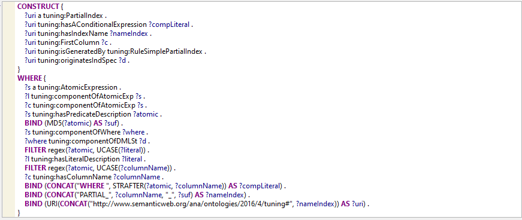

# Regras de Sugestões de Índices Hipotéticos e Parcial

 Podem ser encontradas no seguinte caminho na OnDBTuning, conforme destacado na figura abaixo em amarelo:

São elas:

**RuleHypSimpleIndex**

**RuleHypCompositeIndex**

**RuleSimplePartialIndex**

