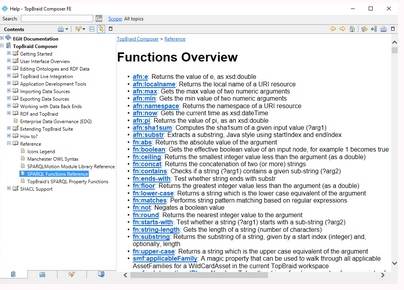
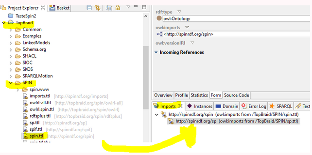
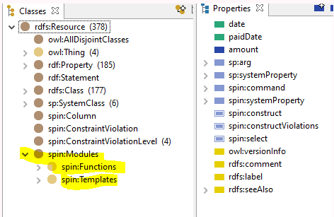
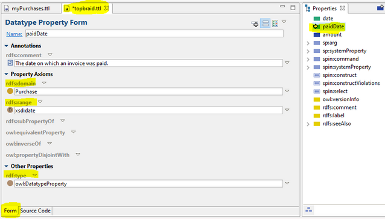
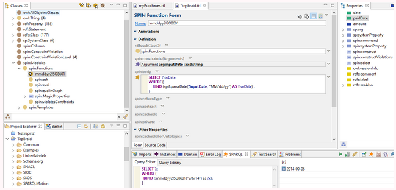
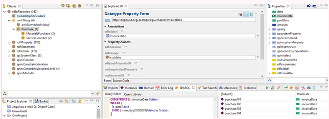
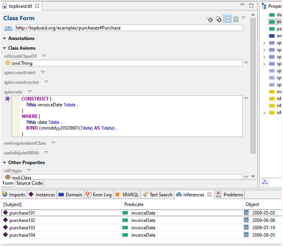

# Dicas do Tutorial TopBraid

Segue abaixo algumas dicas sobre o Tutorial da ferramenta TopBraid:

Para encontrar mais informações sobre funções SPIN no TopBraid, ir em "Help" e navegar, conforme imagem abaixo:

Importando "spin.ttl" , arrastar esse arquivo para aba "Imports":

Algumas "Classes" e "Propriedades", após importar, conforme figuras abaixo:

Duplo clique em "Properties" dá para ver mais informações:

Exemplo de função criada e executada:

**Inferência**

Consultando a inferência na aba SPARQL:

 Executando a Inferência:

 **Observação:** "To recalculate inferred values using the Free edition of TopBraid Composer, select Reset Inferences from the Inference menu to remove inferenced values and then Run Inferences again."

# Referência

https://www.topquadrant.com/spin/tutorial/