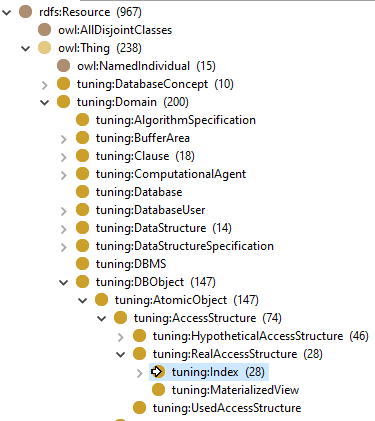
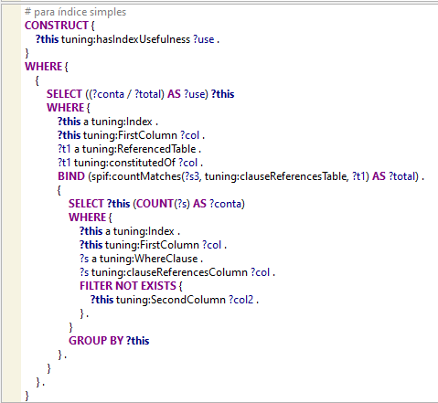
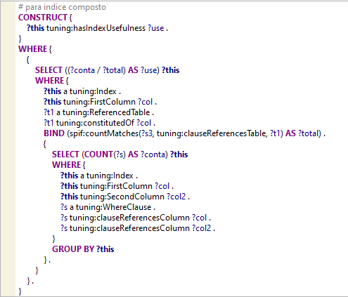

# Regra para Cálculo da Utilidade

 Pode ser encontrada no seguinte caminho na OnDBTuning, conforme destacado na figura abaixo em azul:

**tuning:hasIndexUsefulness (para índice simples)**

**tuning:hasIndexUsefulness (para índice composto)**

